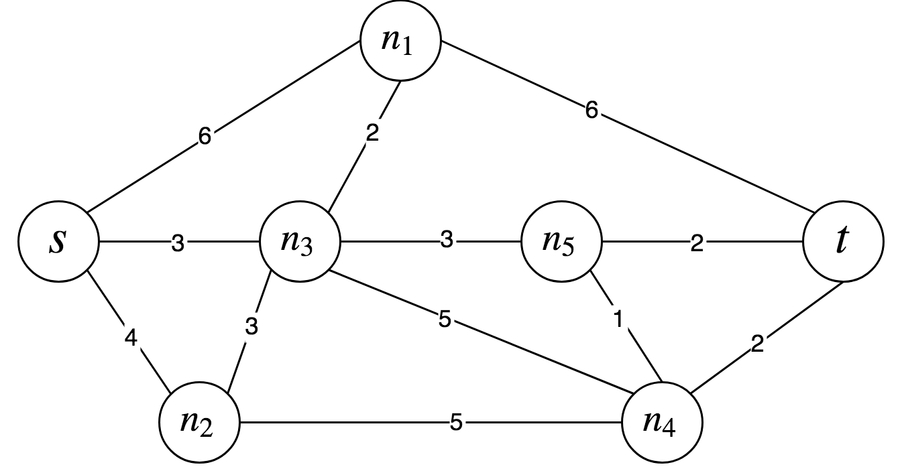

# Getting started
In this document, we provide an introduction to **ARLib**, an alternative routing
library for [Boost.Graph]. *Alternative routing* is defined as the problem of
finding a number *k* of *s-t* paths in a graph *G*. While the problem of finding
**the** shortest *s-t* path in a graph has well-known, efficient solutions (most
notably the [Dijkstra's algorithm]), finding several *s-t* paths introduces a 
number of challenges. In fact, alternative paths are desired to be (a) as short
as possible (b) sufficiently dissimilar from each other.

**ARLib** provides an implementation of the following state-of-art algorithms:
 - *K-SPwLO* OnePass+
 - *K-SPwLO* ESX
 - Penalty
 
### 1. Let's start
First of all, let's construct the graph that we are going to use in this example:


**ARLib** is a library for Boost.Graph, so building a graph is the same as you do
in Boost.Graph

```cpp
#include <boost/graph/adjacency_list.hpp>
#include <boost/graph/graph_traits.hpp>

#include <string>
#include <vector>

// Create type-aliases for the Graph type
using Graph = boost::adjacency_list<boost::vecS, boost::vecS,
                                    boost::bidirectionalS, boost::no_property,
                                    boost::property<boost::edge_weight_t, int>>;
using Vertex = typename boost::graph_traits<Graph>::vertex_descriptor;
using Edge = typename boost::graph_traits<Graph>::edge_descriptor;

int main() {
  // Make convenient labels for the vertices
  enum { S, N1, N2, N3, N4, N5, T };
  const long unsigned num_vertices = T;
  const auto name =
      std::vector<std::string>{"s", "n1", "n2", "n3", "n4", "n5", "t"};

  // Writing out the edges in the graph
  const auto edges = std::vector<std::pair<int, int>>{
      {S, N1},  {N1, S},  {S, N2},  {N2, S},  {S, N3},  {N3, S},
      {N1, T},  {T, N1},  {N3, N1}, {N1, N3}, {N3, N5}, {N5, N3},
      {N3, N2}, {N2, N3}, {N3, N4}, {N4, N3}, {N2, N4}, {N4, N2},
      {N5, T},  {T, N5},  {N5, N4}, {N4, N5}, {N4, T},  {T, N4}};

  const auto weights = std::vector<int>{6, 6, 4, 4, 3, 3, 6, 6, 2, 2, 3, 3,
                                        3, 3, 5, 5, 5, 5, 2, 2, 1, 1, 2, 2};
  auto G = Graph{edges.begin(), edges.end(), weights.begin(), num_vertices};
}
```

Now that we have built our graph, we are ready to run an alternative routing (AR)
algorithm. Just like any algorithm in Boost.Graph, also ARLib algorithms are
fully generic and defined in terms of [Graph Concepts] and [Property Maps]. 

### 2. An Alternative Routing algorithm

Let's consider **OnePass+** algorithm:

```cpp
template <
    typename Graph, typename WeightMap, typename MultiPredecessorMap,
    typename Vertex = typename boost::graph_traits<Graph>::vertex_descriptor>
void onepass_plus(const Graph &G, WeightMap weight,
                  MultiPredecessorMap &predecessors, Vertex s, Vertex t, int k,
                  double theta)
```

Consistently with Boost.Graph algorithms, ARLib algorithms define what graph
operations are necessary to implement them. So for `onepass_plus`, the input
graph is required to satisfy both `VertexAndEdgeListGraph` and `AdjacencyMatrix`
concepts.

Moreover, necessary vertex and edge properties are passed as [Property Maps]. In
details:
 - `WeightMap` is the edge weight property map, e.g. the one you can obtain with 
   `get(boost::edge_weight, G)`.
 - `MultiPredecessorMap` is an output property map to store the alternative paths,
   which we describe in details in [Section 2.1].
   
The remaining arguments are OnePass+ parameters:
 - `s` and `t` are the source and target vertices, respectively.
 - `k` is the number of alternative routes that we request.
 - `theta` is the percentage of overlapping threshold. Alternative routes are
   guaranteed to overlap no more than `theta` percentage.

So let's compute our alternative routes.

 ```cpp
#include "arlib/arlib.hpp"
 
/// Define a convenient function to compute the alternative routes and return
/// them as a view.
std::vector<arlib::Path<Graph>> get_alternative_routes(Graph const &G, Vertex s,
                                                        Vertex t) {
  // Make output MultiPredecessorMap
  auto predecessors = arlib::multi_predecessor_map<Vertex>{};
 
  int k = 3;                                       // Nb alternative routes
  double theta = 0.5;                              // Overlapping threshold
  auto weight = boost::get(boost::edge_weight, G); // Get Edge WeightMap
 
  arlib::onepass_plus(G, weight, predecessors, s, t, k, theta);
  auto alt_routes = arlib::to_paths(G, predecessors, weight, s, t);
  return alt_routes;
}
 ```
 
First, we define a convenient function, `get_alternative_routes`, to find **3**
*s-t* paths with a maximum similarity of **50%**. Then we extract a view of them
and pack them into a `std::vector`.

#### 2.1 Introducing multi_predecessor_map
With line

```cpp
auto predecessors = arlib::multi_predecessor_map<Vertex>{};
```

we instantiate a `multi_predecessor_map`. It models the
`ReadablePropertyMap` concept and we use it to keep track of the predecessors of
each vertex in the alternative routes. Its `key_type` is the same as the vertex 
descriptor of the graph. The `value_type` is an `UnorderedAssociativeContainer`,
like `std::unordered_map`, such that each entry maps an `int` to a vertex
descriptor. The `int` value represents the index of the alternative path,
which ranges in `[0, k]`. 

For instance, let `v` be a node of the graph and `MP` be a 
`multi_predecessor_map`. `MP[v]` returns a reference to an 
`UnorderedAssociativeContainer` `P`. Each entry of `P` is a pair `(n, p)`, where
`n` is the index of the alternative path for which `p` is the predecessor of `v`.

In line

```cpp
arlib::onepass_plus(G, weight, predecessors, s, t, k, theta);
```

we effectively run OnePass+ algorithm to compute the alternative routes, which 
are recorded in `predecessors`, just like you are used to in Boost.Graph's
`dijkstra_shortest_paths` algorithm.

In ARLib we make one step further. We are interested in actually querying the
alternative routes that we found. Therefore, we provide a function to decode the
`multi_predecessor_map` into a sequence of views on the paths.

In line

```cpp
auto alt_routes = arlib::to_paths(G, predecessors, weight, s, t);
```

with call `arlib::to_paths` to build such a sequence. `alt_routes` is a
`std::vector` of `arlib::Path`. `arlib::Path` is nothing more than a wrapper
around a `boost::filtered_graph` of the input graph. Doing so allow us to return
paths that are fast-to-build and easy-to-query because `boost::filtered_graph`
exposes the same interface of the original graph.

#### 2.2 Ready to go

So now, let's see what alternative routes we have found. We define the following
utility function to print our paths

```cpp
#include <iostream>

void print_path(arlib::Path<Graph> const &path,
                std::vector<std::string> const &name) {
  using namespace boost;

  for (auto [v_it, v_end] = vertices(path); v_it != v_end; ++v_it) {
    for (auto [e_it, e_end] = out_edges(*v_it, path); e_it != e_end; ++e_it) {
      std::cout << name[source(*e_it, path)] << " -- "
                << name[target(*e_it, path)] << "\n";
    }
  }
}
```

Finally, obtain your results

```cpp
int main() {
  // Graph construction
  ...
  
  auto alt_routes = get_alternative_routes(G, S, T);
  
  for (auto const &route : alt_routes) {
    print_path(route, name);
    std::cout << "--------\n";
  }
}
```

which displays

```text
s -- n3
n3 -- n4
n4 -- t
--------
s -- n3
n3 -- n5
n5 -- t
--------
s -- n3
n1 -- t
n3 -- n1
--------
```

### 3. Next steps
Congratulations! You found your first set of alternative routes! If you want to
know more check the following resources out:
 - [Include ARLib in your CMake project][cmake-example]
 - [Uninformed Bidirectional Pruner] - *a pre-processing algorithm that reduces the
   complexity of your graph to speed-up the alternative routing*
 - [Documentation] - *for a full list of the algorithms shipped by ARLib*

 
### 4. References
| Algorithm | Paper |
|---------- | ----- |
| OnePass+  | Theodoros Chondrogiannis, Panagiotis Bouros, Johann Gamper and UlfLeser, Exact and Approximate Algorithms for Finding k-Shortest Paths with Limited Overlap , In Proc. of the 20th Int. Conf. on Extending Database Technology (EDBT) (2017)
| ESX       | Theodoros Chondrogiannis, Panagiotis Bouros, Johann Gamper and Ulf Leser, Exact and Approximate Algorithms for Finding k-Shortest Paths with Limited Overlap , In Proc. of the 20th Int. Conf. on Extending Database Technology (EDBT) (2017)
| Penalty   | Yanyan Chen, Michael GH Bell, and Klaus Bogenberger. Reliable pretrip multipath planning and dynamic adaptation for a centralized road navigation system. Intelligent Transportation Systems, IEEE Transactions on, 8(1):14–20, 2007

----------------------------

[Home]

[Boost.Graph]: https://www.boost.org/doc/libs/1_68_0/libs/graph/doc/
[Dijkstra's algorithm]: https://en.wikipedia.org/wiki/Dijkstra%27s_algorithm
[Graph Concepts]: https://www.boost.org/doc/libs/1_68_0/libs/graph/doc/graph_concepts.html
[Property Maps]: https://www.boost.org/doc/libs/1_68_0/libs/graph/doc/using_property_maps.html
[Section 2.1]: #21-introducing-multi_predecessor_map
[cmake-example]: include_in_cmake_project.md
[Documentation]: https://leonardoarcari.github.io/arlib
[Home]: https://github.com/leonardoarcari/arlib/blob/master/README.md
